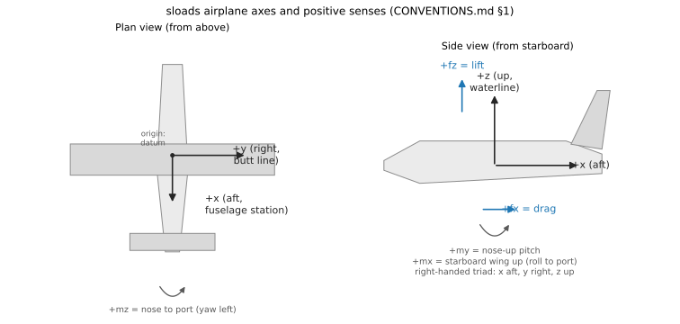
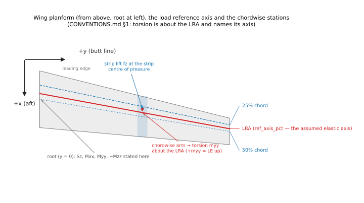
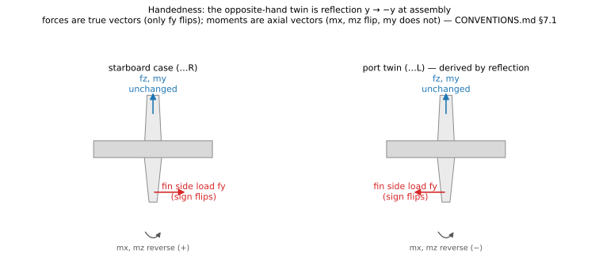

# Chapter 2 — Conventions: Axes, Signs, Units and the Load Contract, Explained

**The normative single source for every convention is
[`../10_standard/CONVENTIONS.md`](../10_standard/CONVENTIONS.md)** — the
conventions charter, whose rules are enforced by single-source code owners and
drift-guard tests (its §7 table). This chapter is the *illustrated
explanation*: why each convention is what it is, how to read a sloads number
without mis-signing it, and the mistakes the conventions exist to prevent.
Where a sentence here and the charter disagree, the charter wins. Section
references of the form "§n" below are the charter's.

## 2.1 The airplane frame

Everything internal to sloads is stated in one right-handed Imperial airplane
frame (§1):

- **x** — fuselage station, **positive aft**, in inches from the datum.
- **y** — butt line, **positive right** (starboard).
- **z** — waterline, **positive up**.

Loads follow directly: `fz` is lift (+up), `fx` is drag (+aft). The positive
moment senses are forced by right-handedness, not chosen: **+mx rolls to port**
(starboard wing up), **+my pitches nose-up**, **+mz yaws nose to port**. The
practical consequence for a reader: a conventionally loaded wing shows
*positive* root bending `Mxx`, and an ordinary nose-down pitching moment from
lift aft of the CG is a *negative* `my`.

The export frame is NASTRAN basic CID 0, and the sloads frame already matches
it — the transform to a deck is the identity, and
`sloads/export/coordinates.py` is the **only** place any load or coordinate is
multiplied by anything on its way out (§1). If you suspect a sign problem in a
deck, that file is the entire search space.

**Best practice:** never describe a load by "up/down at the tail" in a design
note or a test comment — state the component (`fz`, `my`, …) in this frame.
The suite's own history shows the alternative fails: the sign-convention
extraction of 2026-08-09 (§1.1, decisions SC-1…SC-6) had to reverse-engineer
six undocumented sign choices out of the ported BASIC.

## 2.2 State and control signs (§1.1)

The airplane-state conventions an engineer touches most:

- **α** is nose-up positive, waterline to relative wind; +α gives +lift.
- **Sideslip:** `+β` = relative wind from **starboard**; the vertical tail's
  restoring load is then `−fy`.
- **Elevator** is trailing-edge-**down** positive; **rudder** deflection is an
  unsigned magnitude whose load is always `+fy`; **aileron** deflections are
  per-direction magnitudes and acquire a hand only at assembly (§2.4).
- **Load factors:** `nz` +up, `nx = −DX/W` (negative for ordinary aft drag),
  `n_y = L_v/W` +starboard.
- **Gusts:** `Ude` is a positive magnitude; the ± hand is applied by the
  caller.
- Attitude angles and body rates **do not exist as state** anywhere in the
  suite — only closure accelerations and the enumerated gyroscopic cases. No
  document may imply otherwise (§1.1).

## 2.3 The wing frame: LRA, torsion, and what a station table means

Spanwise results are stated at stations along the **load reference axis
(LRA)** — the grid line at the entered `ref_axis_pct` chord, which is *by
declaration* the assumed elastic axis (§1, note 24 R-7d). Torsion `Myy` is
about the LRA and **+Myy is leading-edge-up**; a lift resultant aft of the
axis gives the negative root torsion the Appendix A oracles print. Three rules
keep a station table honest (§1, reporting rules):

1. **A torsion always names its axis** (LRA as %chord). A torsion without an
   axis is not a number.
2. **A cumulative torsion is not a free moment.** `Myy` at a station already
   contains the sweep/dihedral transfer of outboard shear; applying a strip's
   position offset *and* its cumulative torsion double-counts the transfer —
   measured at 20 % of n·W·MAC. Only the section `Cm` is free.
3. **Envelopes are two-sided** (max *and* min per station) and maxima carry
   their station: the conditions that size a GA horizontal tail are
   *down*-load, and a one-sided envelope hides exactly them.

## 2.4 Handedness: left and right cases (§7.1)

Every asymmetric case has an opposite-hand twin, **derived by reflection
(`y → −y`) at balanced-case assembly** — never by re-running the aerodynamics,
so the oracle-locked FAR 23 path never sees handedness at all. The rule that
must not be paraphrased: a **force** is a true vector, so only `fy` changes
sign; a **moment** is an axial vector, so `mx` and `mz` reverse and `my` does
not. Applying the force rule to a moment mirrors a rolling case into itself.
Whether a case *has* a hand is decided by the content of its applied load set
before closure, not by its name — a rudder-kick case whose side forces nearly
cancel in the resultant is still handed. Hand is a suffix on the existing case
id (`W-05R`/`W-05L`); the unhanded id remains the physical condition.

## 2.5 The empennage exceptions (§7.2)

The horizontal tail maps exactly like the wing (span along `y`, load `fz`,
torsion `myy`). The **vertical tail does not**: it spans along `z`, its air
load is the side force **`fy`**, and its torsion is **`mzz`** with the stored
strip torsion's sign negated. A vertical-tail deck written with the h-tail's
mapping parses, solves, and loads the surface in the one direction it is not
designed for — which is why the mapping has one owner and a drift guard rather
than a comment.

Two bookkeeping conventions matter to anyone entering tail data: surface
polylines are **one side** of a symmetric surface while every scalar tail
quantity (areas, SELECT's `LT25`/`LT50`) is **whole-surface**; and the h-tail
beam is **full span, tip to tip through the centreline** — the only topology
that carries the 23.427(a) left/right asymmetry in one model. Vertical
placement is load-bearing, not cosmetic: the vertical tail's root waterline
sets the roll arm `−Fy·(z − z_cg)` of every lateral case, and the body beam's
waterline is a structural statement distinct from where its masses sit (§7.2
records the measured incidents behind both).

## 2.6 Units and the two delivery channels (§2)

**Imperial is the canonical internal system** — calc runs in the original
programs' units (inches, pounds). SI is presentation, converted once at the
boundary, in two channels: **HUMAN** (reports, CSVs: N·m, kPa) and **SOLVER**
(bulk data and span CSVs: **N·mm, MPa** — base units combined, so the deck is
dimensionally consistent for a solver). A bundle resolves its unit set once
(`units.deliverable_units`) and every file states its unit set in band.
Airspeeds and altitudes are the carve-out: KEAS and feet in both systems,
never converted. Mass is a distinct channel from weight (`CONM2` carries
mass), with the consistency identity `force/(mass × length) = g` enforced.

## 2.7 The LIMIT load contract (§3)

**Every load sloads delivers is LIMIT, and the safety factor is stated per
case and applied nowhere.** This is the single most important convention for a
consumer of sloads output:

- The 14 CFR 23.303 factor (1.5) is applied by the *sizing* analysis. Every
  deck and document states, per subcase, the factor it did not apply — the
  statement replaces the multiply, and it is what stands between a recipient
  and a 1.5× error.
- The `-ULT` marker survives on exactly two families the regulation prescribes
  already ultimate: 23.367(a)(2) sudden engine stoppage and 23.561(b)
  emergency-landing inertia (`ULT SF=1.0` — apply nothing further).
- The factor for every case is a derived view of the **governing safety-factor
  table** (`sloads/safety_factors.py`), one row per Subpart C condition
  family. A case the table cannot classify is flagged, never silently
  defaulted; a condition that is not a load case prescribes **no** factor and
  renders `N/A`.
- The contract applies to loads only — never to geometry, weights, speeds or
  dimensionless factors — and the producer has the last word on whether a
  value in load units is a load.

The charter's §3 carries the owners and gate names; the regulatory reading of
record is [`00_theory_sources.md`](00_theory_sources.md) §Limit vs. ultimate.

## 2.8 Case identity (§4)

A physical condition has **one** case id (`W-01`, `HT-03`, `VT-02`, `F-04`,
`EM-01`, `LG-05`), minted once by the first module that names it and never
re-minted — SELECT's critical wing condition and the distribution derived from
it are one case. Deck subcase integers are *derived* from the id (never from
position in an export, so filtering cannot renumber survivors), and the
assembled deck carries hand as a numeric block, not a suffix. Every
deliverable that shows a subcase number qualifies it by deck family. When
citing a case in analysis or correspondence, use the case id plus the FAR
reference; the condition label is cosmetic.

## 2.9 Rules of thumb the conventions encode

Collected here because each was learned at a measured cost (citations in the
charter and the validation chapters):

- **Inertia is signed by the load factor alone**, never "opposing the air
  load" — the opposing rule relieves exactly the down-load conditions that
  size a GA horizontal tail (§7.2).
- **A surface's inertia acts along its own normal axis** — the vertical tail
  takes a lateral bending term *and* a vertical axial term; passing a vertical
  factor where the lateral one belongs is structurally prevented (§1).
- **Each mass enters exactly one field** — a mass the assembly spreads
  contributes no separate self-inertia, a cut reaction never reappears in the
  assembled model, and the fuselage beam carries everything except the wing
  (§1).
- **A residual the airplane is not meant to balance is reported, never
  gated** — the aileron couple of a rolling case and the vertical-tail load of
  a lateral case *are* the applied load; gating them to zero would demand a
  fictitious balancing force (§1; chapter 9).
- **Ground and flight are separate governing families** — never enveloped
  together, because their station extremes belong to different total load
  states (§1, decisions G-9/D-28).

## Sources

- [`../10_standard/CONVENTIONS.md`](../10_standard/CONVENTIONS.md) — the
  charter this chapter explains; its §7 table names every owner and guard.
- [`00_theory_sources.md`](00_theory_sources.md) — regulatory citations for
  the LIMIT contract and the governing safety-factor table.
- Figures: `figures/*.svg`, rendered by `scripts/render_theory_figures.py`
  (schematics drawn from the charter, no fixture data — re-run after editing).
