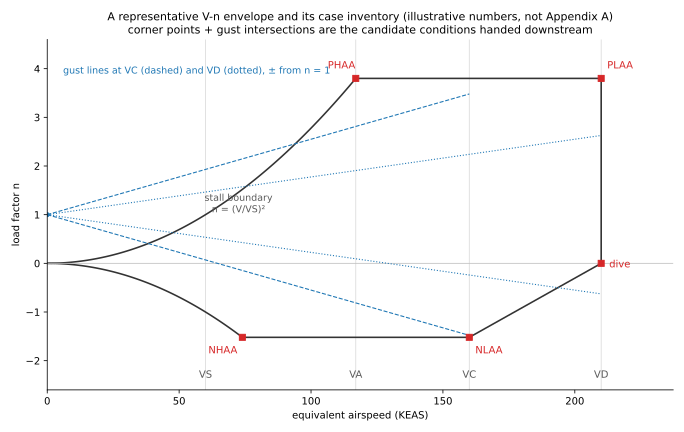

# Chapter 3 — Design Airspeeds and the V-n Envelope (STRSPEED / MACHLIM / FLTLOADS)

How the `structural_speeds` module (`sloads/modules/structural_speeds.py`, ported
from `STRSPEED.BAS`) and the `mach_limit` module (`sloads/modules/mach_limit.py`,
ported from `MACHLIM.BAS`) define the structural design airspeeds, the limit
maneuver load factors, the cruise/dive Mach numbers, and the speed families
derived from them (Mach-limit lines, preliminary operating-limitation placards).
§13 then covers the flight envelope those speeds bound — the `flight_envelope`
module (FLTLOADS) — and the **case inventory** it hands downstream: this chapter
owns what conditions exist; which of them govern a component is each component
chapter's own opening section (ch04 §Cases analyzed for SELECT's wing/fuselage
down-select; ch05/ch08 for the empennage and ground families).

- **Source of truth:** Reference 1 (McMaster) Ch 6; the regression oracle is
  Appendix A (GA single) — design speeds p155–156, Mach lines p160. The
  `structural_speeds` and `mach_limit` modules are **oracle-locked** (±0.1%,
  Decision 3) — see [`00_theory_sources.md`](00_theory_sources.md#oracle-status).
- **Regulations:** FAR 23.335 (design airspeeds), 23.337 (limit maneuver load
  factors), 23.345(b) (flap design speed floor), all at the suite's
  **pre-Amdt-23-64** basis; 14 CFR **25.335(b)** for the Mach-margin dive-speed
  route (F25-2, concept category only); 23.1505/23.1511 (Subpart G airspeed
  limitations) for the *advisory* placards. Verbatim regulation captures:
  `reference/14CFR_25_335_design_airspeeds.md`,
  `reference/14CFR_MC_MD_speed_margin.md`,
  `reference/14CFR_operating_limitations.md`.
- **Units:** every speed in this document (and in the modules) is **knots
  equivalent airspeed (KEAS)** unless stated otherwise. Dynamic pressure uses the
  suite convention `Q [lb/ft²] = V²/295` with `V` in KEAS, which folds the
  density ratio into the airspeed. Weights lb, areas ft², altitudes ft.
- **Consumers:** downstream modules (AILERON / FLAPLOAD / TABLOADS, the V-n
  envelope, the flight-limits diagram) read the resolved
  `DesignSpeeds` tuple — they never re-derive a design speed
  ([`PROGRAM_SPEC.md`](../10_standard/PROGRAM_SPEC.md); module contract).

> **Chosen vs. minimum.** Every design speed has a FAR *minimum* computed from
> the equations below. A user-chosen speed is verified against its minimum and
> **raised** to it when short; leaving a chosen speed unset takes the minimum
> directly. The reported `*_min` values are the floors that actually governed.
> In concept mode (category `C`) the GA-calibrated minimums become out-of-band
> *advisories* — the chosen speeds govern (see §2 and §5.1).

---

## 1. Symbols

| Symbol | Meaning | Source |
|---|---|---|
| `W` | design weight (lb) | input `speeds.weight_lb` |
| `S` | wing area (ft²) | geometry wing surface, else `speeds.wing_area_sqft` |
| `W/S` | wing loading (lb/ft²) | derived |
| `CLmax`, `CLmax_f` | max lift coefficient, clean / flaps down | `Project.aero_coeffs` (`clmax_clean` / `clmax_flap`) |
| `VS`, `VSF` | 1-g stall speed, clean / flaps down (KEAS) | derived, §3 |
| `n`, `n_neg` | limit positive / negative maneuver load factor | §4 |
| `VC`, `VD`, `VA`, `VF` | design cruise / dive / maneuver / flap speeds (KEAS) | §5–§8 |
| `VH` | maximum level-flight speed at sea level (KEAS) | input `speeds.vh_kt` |
| `VB` | design speed for maximum gust intensity (KEAS) | input `speeds.vb_kt` (Part 25 concepts; ordering check only, §10) |
| `a`, `σ` | speed of sound (kt), density ratio at altitude | standard atmosphere, §9 |
| `MC`, `MD` | cruise / dive Mach at the shoulder altitude | §9 |
| `MNE` | never-exceed Mach | §11 |
| `VNE`, `VNO`, `VFE`, `VMO`, `MMO` | operating-limitation (placard) speeds | §12 |

**Categories.** `N` normal (and commuter), `U` utility, `A` acrobatic — the FAR 23
set; `C` **concept** — the superset mode for configurations outside the FAR 23
caps (>12,500 lb, high-subsonic). Category `C` reduces exactly to the FAR 23 path
on GA inputs; where it departs, this document says so explicitly.

---

## 2. Data flow

```
CLmax (aero page) ──► VS, VSF ──► VA_min, VF_min
W, S ──► W/S ──► n (23.337) ──► VA_min
W/S ──► Kc, Kd schedules ──► VC_min ──► VD floors
shoulder altitude ──► a, σ ──► MC = VC/(a·√σ), MD = VD/(a·√σ)
MC, MD ──► MACHLIM lines (MNE, V(M) vs altitude)
VC, VD, VF, MC, MD ──► placards VNE/VNO/VFE (recip) · VMO/MMO (turbine)  [advisory]
```

`design_speed_values` is the **single producer** of every quantity above. In
particular MC/MD are *not* MACHLIM inputs (F25-2, schema v40): `mach_limit.run`
calls `design_speed_values` and passes its MC/MD in, so the CLI and GUI can never
disagree about the same project's Mach lines.

---

## 3. Stall speeds VS / VSF

Setting lift = weight at `CLmax` with the suite's `Q = V²/295` EAS convention:

```
VS  = sqrt(295·(W/S)/CLmax_clean)          clean, 1-g          [KEAS]
VSF = sqrt(295·(W/S)/CLmax_flap)           flaps down, 1-g     [KEAS]
```

(`constants.stall_speed_kt`; User's Guide p7-5.) `CLmax` is entered **once**, on
the Aerodynamic Data page, and is the single stall source (M1-1b) — there is no
stall-speed scalar input. Both are evaluated at the design weight `W`.

## 4. Limit maneuver load factors (FAR 23.337)

```
n_min     = 2.1 + 24000/(W + 10000)     capped at 3.8      category N (and commuter)
n_min     = 4.4                                            category U
n_min     = 6.0                                            category A
n_neg,min = -0.4·n     (N, U)
n_neg,min = -0.5·n     (A)
```

A chosen `n` is raised to `n_min`; a chosen negative factor is accepted only if
at least as negative as `n_neg,min` (Reference 1 Ch 6; `maneuver_load_factors`).

**Concept (`C`):** the 23.337 formula and cap are GA-only calibration, so
category `C` bypasses them entirely — `chosen_n` and `chosen_nneg` are
**required** and used verbatim, with no FAR floor. The reported "minimum
required" figures echo the chosen values.

## 5. Design cruise speed VC (FAR 23.335(a))

```
VC_min = Kc·(W/S)^0.5        but VC_min need not exceed 0.9·VH
VC     = max(chosen VC, VC_min)
```

`Kc` (`constants.cruise_speed_coefficient`, Reference 1 Ch 6) is constant at
`K0` up to `W/S = 20`, tapers linearly to **28.6** at `W/S = 100`, and is
**clamped at 28.6 above `W/S = 100`**:

| Category | K0 (W/S ≤ 20) | at W/S = 100 |
|---|---|---|
| N, U | 33.0 | 28.6 |
| A | 36.0 | 28.6 |

### 5.1 Out-of-band wing loadings (concept mode)

`W/S > 100` is outside 23.335's tabulated schedule. The coefficients are held at
their `W/S = 100` values (Kc 28.6, Kd 1.35) and the resulting VC_min/VD_min are
flagged **OUT-OF-BAND** — GA-extrapolated advisories only; the concept supplies
`chosen_vc`/`chosen_vd`, which govern.

## 6. Design dive speed VD — two regulatory routes

25.335(b) offers the dive speed **disjunctively**: a speed-ratio floor **or** a
minimum MC→MD speed margin. The key algebraic identity (recorded in
`reference/14CFR_25_335_design_airspeeds.md`):

> `VC/MC ≤ 0.8·VD/MD` **is** `VD ≥ 1.25·VC` — the ratio floor the suite has
> always applied is Part 25's first route, not a Part 23 peculiarity.

`speeds.vd_basis` selects the route (`VdBasis.SPEED_RATIO`, the default, or
`VdBasis.MACH_MARGIN`).

### 6.1 Speed-ratio route (default; FAR 23.335(b)(1)–(3))

```
VD_min = max(Kd·VC_min, 1.25·VC)
VD     = max(chosen VD, VD_min)
```

Both minimums apply. Note the `Kd` term multiplies the **minimum** cruise speed
`VC_min`, not the chosen VC (STRSPEED.BAS lines 380/390, `V2DMIN = K2·V1CMIN`).
`Kd` (`constants.dive_ratio_coefficient`) follows the same taper-and-clamp
schedule as Kc:

| Category | K0 (W/S ≤ 20) | at W/S = 100 |
|---|---|---|
| N | 1.40 | 1.35 |
| U | 1.50 | 1.35 |
| A | 1.55 | 1.35 |

With no chosen speeds the `Kd·VC_min` term governs (Appendix A p155, category N:
198.53 kt); for the worked chosen-speeds example (p156) the chosen VD = 212.5
already clears both floors. **Concept (`C`)** treats the GA-calibrated `Kd` term
as advisory only — the `1.25·VC` floor is the only hard one.

### 6.2 Mach-margin route (25.335(b)(2) / 23.335(b)(4)(iii); F25-2)

```
MD ≥ MC + margin        i.e.  VD = max(chosen VD, (MC + margin)·a·√σ)
```

evaluated at the shoulder altitude (required non-zero — the margin is a statement
about MC and MD, which only exist where the Mach limit is established). A
`chosen_vd` is required (the route exists so a concept nominates its own VD/MD);
it is **raised** to the margin floor when short, like every other minimum. On
this route the `1.25·VC` floor does **not** also apply — the two routes are the
regulation's own disjunction — but what `1.25·VC` *would* have been is always
reported (`vd_ratio_floor`) so the difference between the routes is auditable.

**The margin policy** (`resolve_mach_margin`, the single owner — the design-speed
resolution, the placard ladder and `sloads.validation` all call it):

| `mach_margin_min` | basis given? | outcome |
|---|---|---|
| unset | — | **0.07 M**, the rule default (Amdt. 25-91; AC 25.335-1A) |
| ≥ 0.07 | — | accepted as declared |
| 0.05–0.07 | **required** | accepted, flagged `reduced` (certification risk) |
| 0.05–0.07 | missing | `ValueError` — 25.335(b)(2) demands a rational analysis incl. automatic systems |
| < 0.05 | — | `ValueError` — the **0.05 M absolute floor** is not an input |

The 0.05/0.07 split is FAR 23's own as well: 23.335(b)(4)(ii) gives 0.05 M for
N/U/A, (b)(4)(iii) gives 0.07 M for commuter with the rational-analysis path back
to 0.05 (`reference/14CFR_MC_MD_speed_margin.md` §1–2).

**Route restriction (decision D-1, F25-2):** the margin route is available in
concept category `C` only, so the Appendix-A-oracle-locked FAR 23 path is
provably untouched. 23.335(b)(4) would also permit it for N/U/A; extending it
there is a backlog item.

**Documented gap — not a sufficiency demonstration.** 25.335(b) requires the
**greater of** the (b)(1) upset-criterion speed increase (7.5° / 20 s / 1.5 g)
and the (b)(2) Mach margin. Only the Mach term is evaluated; the upset term is
**not implemented** (backlogged), and every margin-route output says so.

## 7. Design maneuver speed VA (FAR 23.335(c))

```
VA_min = VS·√n
VA     = max(chosen VA, VA_min)     but VA ≤ VC
```

VA is the corner of the V-n diagram: the lowest speed at which the limit positive
load factor can be reached at CLmax. It need not exceed VC.

## 8. Design flap speed VF (FAR 23.345(b))

```
VF_min = max(1.4·VS, 1.8·VSF)
VF     = max(chosen VF, VF_min)
```

(1.4 × the clean stall speed or 1.8 × the flaps-down stall speed, whichever is
greater; Reference 1 Ch 6.)

## 9. Atmosphere and the cruise/dive Mach numbers

The suite's standard atmosphere (`constants.standard_atmosphere`, Reference 1
Ch 6), below the tropopause (`H ≤ 35,332 ft`):

```
T     = 59 − 0.003566·H                  [°F]
a     = 29.02436·(T + 459.4)^0.5         [kt]   (speed of sound)
σ     = (1 − 0.000006879·H)^4.258               (density ratio)
```

Above the tropopause `a` is constant and `σ` follows the isothermal exponential
law. (The original BASIC used `a = 29.02…` with coefficient 29.02; the shared
atmosphere uses 29.02436 — a ~0.01% difference absorbed by the ±0.1% oracle
tolerance, Decision 3.)

An equivalent airspeed maps to Mach at altitude through

```
M = KEAS/(a·√σ)          KEAS = M·a·√σ
```

so at the **shoulder altitude** (the dividing line between the EAS-limited and
Mach-limited regimes, input `speeds.shoulder_altitude_ft`):

```
MC = VC/(a·√σ)           MD = VD/(a·√σ)
```

## 10. Part 25 cruise-speed margin and VB (ordering check only)

25.335(a)(2) requires `VC ≥ VB + 1.32·U_ref` with `U_ref` from
25.341(a)(5)(i), and 25.335(d) defines VB via the Pratt gust factor
`Kg = 0.88μ/(5.3 + μ)` applied to the reference gust. **U_ref is not implemented
anywhere in the suite** — it arrives with F25-1's transport gust pack, which will
also own computing VB. Until then `speeds.vb_kt` is accepted as an input and
checked for **ordering only** (`VB < VC ≤ VD`, warn-only in
`sloads.validation`); the `+ 1.32·U_ref` term is explicitly deferred. Note
25.335(d)(2)(ii) permits `VB ≤ VC` at Mach-limited altitudes, which is why the
ordering check warns rather than errors.

## 11. Mach-limit lines (MACHLIM; FAR 23.335(b))

Above the shoulder altitude the cruise/dive limits are set by Mach number rather
than EAS. From MC/MD (produced by `design_speed_values`, §2):

```
MNE = 0.9·MD             never-exceed Mach
V(M) = M·a·√σ            [KEAS]  at each altitude
```

`mach_limit_lines` tabulates `V(MC)`, `V(MNE)` and `V(MD)` from the shoulder
altitude to the maximum operating altitude in `increment_ft` steps (the last step
lands exactly on the max altitude), for the flight-limits diagram.

**Flutter clearance is deliberately not here.** MACHLIM.BAS also computes
`MFC = 1.2·MD` and its per-altitude `V(FC)`, and this tool reproduced both until
2026-08-26. Flutter substantiation is 14 CFR **23.629**, not a design load, and
the symbol collides with §25.253's VFC/MFC — a different quantity under a
different definition, which a Part 25 reader will read it as. Removed by owner
directive (#79); the withdrawal is registered in
[`02_approved_corrections.md`](02_approved_corrections.md) as a scope reduction,
not as a correction: Appendix A's printed 0.4836 is the right answer to the
original program's equation, and the tool simply no longer answers it. **VF is
unrelated** — every `VF` in this document and in the code is the 23.345 design
flap speed (§8), audited at the same time and found free of any flutter
conflation.

## 12. Operating-limitation speeds vs. design speeds (Subpart G — ADVISORY ONLY)

**These are two different kinds of speed, defined in different regulations.**
The *design* speeds of §§5–8 (VC, VD, VA, VF) live in **Subpart C** (23.335 /
25.335): they are analysis speeds — the envelope the structure is *designed* to,
inputs to the loads calculation, never placarded in the cockpit. The *operating
limitations* (VNE, VNO, VFE, VMO/MMO) live in **Subpart G** (23.1505, 23.1511;
Part 25 counterpart 25.1505 for VMO/MMO): they are the certificated, pilot-facing
limits placarded on the airspeed indicator and in the AFM.

The regulatory coupling runs one way: each operating limitation is **capped by**
its design speed, never the reverse —

| Operating limitation | Defining regulation | Cap from the design speeds |
|---|---|---|
| VNE (never-exceed, recip) | 23.1505(a) | ≤ 0.9·VD (and ≥ 0.9·VD_min) |
| VNO (max structural cruise, recip) | 23.1505(b) | ≤ min(VC, 0.89·VNE) |
| VFE (flap extended) | 23.1511 | ≤ VF |
| VMO/MMO (max operating, turbine/transport) | 25.1505 (Part 23: Ref 1 p47) | ≤ VC/MC |

So **VC can sit above VMO** — the design cruise speed is allowed to exceed the
operating limit, and the structure is then substantiated for speeds the pilot
may never use. In practice the applicant usually *chooses* VMO = VC (and
MMO = MC): setting the operating limit at the design value wastes no envelope,
which is why the two are the same number on most airplanes and why the suite's
preliminary ladder seeds `VMO = VC, MMO = MC`. The distinction still matters in
both directions: a target VMO **below** VC is always available operationally,
while a target VMO **above** VC is infeasible without raising the design speed
(the inversion in the target checks below). *(The Part 25 text of 25.1505 is not
yet captured verbatim in `reference/` — the Part 23 ladder capture is
`reference/14CFR_operating_limitations.md`.)*

The design speeds bound the operating limitations set at certification; the
M2-10 ladder derives the **preliminary** placards those limits imply —
**display/validation only; it never changes a design speed or a load**
(sources: 14 CFR 23.1505/23.1511; Reference 1 p47):

```
VNE = 0.9·VD                     never-exceed            (23.1505(a), recip)
VNO = min(VC, 0.89·VNE)          max structural cruise   (23.1505(b), recip)
MNE = 0.9·MD                     never-exceed Mach       (Ref 1 p47)
VFE = VF                         flap extended           (23.1511)
VMO = VC,  MMO = MC              turbine max operating   (Ref 1 p47)
```

Reciprocating / naturally-aspirated airplanes carry the yellow arc VC→VNE;
turbine (or 23.335(b)(4)) airplanes have **no yellow arc** — VMO/MMO ≤ VC/MC
govern (`speeds.no_yellow_arc`). When the user supplies operational *targets*
the ladder is inverted into required design minima and infeasible targets are
flagged:

```
target VNE ⇒ VD ≥ VNE/0.9          target VMO ⇒ VC ≥ VMO
target VNO ⇒ VC ≥ VNO and VD ≥ VNO/0.89/0.9
target MMO ⇒ MD ≥ MMO + margin     target VFE ⇒ VF ≥ VFE
```

where `margin` comes from `resolve_mach_margin` (§6.2) — the ladder and the
dive-speed resolution can never disagree about the same project's margin (it
replaced a hardcoded 0.05). The implied MC→MD margin `MD − MC` is reported on
**both** dive-speed routes; on the speed-ratio route it is the margin the
`1.25·VC` floor happened to produce, which a transport concept needs to see even
though nothing checked it.

---

## 13. The V-n envelope and the case inventory (FLTLOADS; FAR 23.333 / 23.341)



*(Illustrative shape and numbers — the schematic is drawn from the equations,
not from Appendix A.)*

The design speeds of §§5–8 bound the **flight envelope** of FAR 23.333: the
maneuver diagram (stall line up to `n` at VA, the `n` ceiling across to VD, the
negative boundary through `n_neg` at VC) overlaid with the 23.341 gust lines
from `n = 1` at V = 0 through the derived gust velocities (50 fps at VC, 25 fps
at VD, tapering above 20,000 ft). The `flight_envelope` module (FLTLOADS,
Reference 1 Ch 8) **balances the airplane at every corner** of that envelope:
at each point it finds the angle of attack producing the required load factor
and the horizontal-tail load that zeroes the pitching moment about the CG,

    LT = [MM + LZ·(Xcg − Xw) − DX·(Zcg − Zw)] / (XT − Xcg)
    NZ = (LZ + LT) / W

with the airplane-less-tail coefficients entered as CL/CD/CM polynomials in α,
Glauert-corrected, and the gust load factor per 23.341's Pratt formula
(`Kg = 0.88μ/(5.3 + μ)`). The result is the **balanced matrix** — one row per
condition × CG case × altitude — and that matrix *is* the case inventory: the
maneuver corners (the `MAN A`…`MAN D` and stall-line points, i.e. the
positive/negative high- and low-angle-of-attack families PHAA/PLAA/NHAA/NLAA in
SELECT's naming), the ± gust points at VC and VD, and the level-flight
balancing rows.

**This chapter selects nothing.** The inventory is handed downstream whole:

| Consumer | What it takes | Where described |
|---|---|---|
| SELECT | prunes the matrix to the critical wing (and fuselage) conditions before analysis | ch04 §Cases analyzed |
| Balancing tail loads | one `LT` per envelope point — the h-tail balancing family | ch05 |
| WINGINER / NETLOADS | the selected conditions' wing loads for distribution | ch04 |
| The empennage maneuver/gust conditions | design speeds and load factors only — their cases come from 23.421–23.445, not from this matrix | ch05 |
| Ground families | nothing — a ground case has no V-n point | ch08 |

**Assumptions & limitations.**

- The airplane is **rigid** and balanced quasi-statically at discrete points;
  no dynamic pitch overshoot is modelled at the envelope stage (the checked
  maneuver conditions of 23.423 add the prescribed increments — ch05).
- The aero input is the airplane-less-tail **polynomial fit**; the balance is
  only as good as the entered coefficients, and the compressibility correction
  is Glauert's applied relative to the coefficients' reference Mach.
- The stall-line CL varies with Mach by a least-squares fit to an **AR-6
  23016/23009 wing's** CLmax-vs-Mach curve (Ch 8) — a calibration inherited
  from the manual, adequate for GA sections and unexamined outside them.
- The tail centre of pressure is assumed at ~5 % tail MAC flaps-up / ~25 %
  flaps-down (the Ch 8 "Assumption"); SELECT later refines the chordwise split
  rationally, and the balancing loads inherit whatever error remains.
- Gust load factors use the 23.341 discrete-gust formula; there is **no
  Part 25 gust pack** (no U_ref schedule, no continuous turbulence) — the gap
  and its plan are [`../30_future/04_far25_gap_analysis.md`](../30_future/04_far25_gap_analysis.md).
- The gust cases reuse the manoeuvre **spanwise** shape (decision D-31): inside
  the Schrenk method's own uncertainty band by construction — see
  [`00_theory_sources.md`](00_theory_sources.md) §Base-method uncertainty.

**How it is validated.** Oracle-locked: the balanced matrix is asserted against
Appendix A's printed "V-n Data" (p179–180 — e.g. cruise CG1 `MAN A` V 121.3 /
NZ +3.80 / LT +493) within ±0.1 %, in `tests/test_flight_envelope.py`; the
per-module row in [`00_theory_sources.md`](00_theory_sources.md) is the
authoritative status.

## 14. Worked example (Appendix A, GA six-place single)

Oracle figures asserted in `tests/test_structural_speeds.py` /
`tests/test_mach_limit.py` (±0.1%):

| Quantity | Value | Page |
|---|---|---|
| VD_min, no chosen speeds (cat N, `Kd·VC_min` governs) | 198.53 kt | p155 |
| VA / VC / VD / VF (chosen-speeds run) | 121.3 / 170 / 212.5 / 105.5 kt | p156 |
| n / n_neg | +3.8 / −1.52 | p156 |
| MC / MD at 12,000 ft shoulder | 0.323 / 0.403 | p156 |
| MNE | 0.3627 | p160 |
| ~~MFC 0.4836~~ (p160) | withdrawn from scope 2026-08-26, #79 — see §11 | — |
| V(MC) from 12,000 to 18,000 ft | 170.16 → 150.77 kt | p160 |

## 15. Implementation gaps (Part 25) — documented, not silent

| Requirement | Status |
|---|---|
| 25.335(d) VB formula (Pratt `Kg` on `U_ref`) | **Deferred to F25-1** (transport gust pack owns `U_ref`); `vb_kt` is an input until then |
| 25.335(a)(2) `VC ≥ VB + 1.32·U_ref` | Ordering check only (§10); the `U_ref` term deferred to F25-1 |
| 25.335(b)(1) upset-criterion speed increase | **Not implemented** (backlogged); every margin-route output states it |
| Margin route for FAR 23 categories N/U/A (23.335(b)(4)) | Restricted to concept `C` (decision D-1); extension backlogged |
| Full Part 25 catalog (gust loads, MZFW cases, …) | [`../30_future/04_far25_gap_analysis.md`](../30_future/04_far25_gap_analysis.md) |

## 16. Sources

| What | Where |
|---|---|
| Equations, Kc/Kd schedules, atmosphere, worked example | Reference 1 Ch 6; Appendix A p155–156, p160; `STRSPEED.BAS` / `MACHLIM.BAS` (Appendix C) |
| CLmax → stall-speed path | User's Guide p7-5 |
| 25.335(a)/(b)/(d) verbatim | `reference/14CFR_25_335_design_airspeeds.md` (captured 2026-08-08) |
| 23.335(b)(4) + 25.335(b)(2) margin text, 0.05/0.07 history, AC 25.335-1A practice | `reference/14CFR_MC_MD_speed_margin.md` (captured 2026-07-20) |
| 23.1505/23.1511 + Ref 1 p47 placard ladder | `reference/14CFR_operating_limitations.md` (captured 2026-07-20) |
| Axes/signs/units/ULT contract | [`CONVENTIONS.md`](../10_standard/CONVENTIONS.md) |
